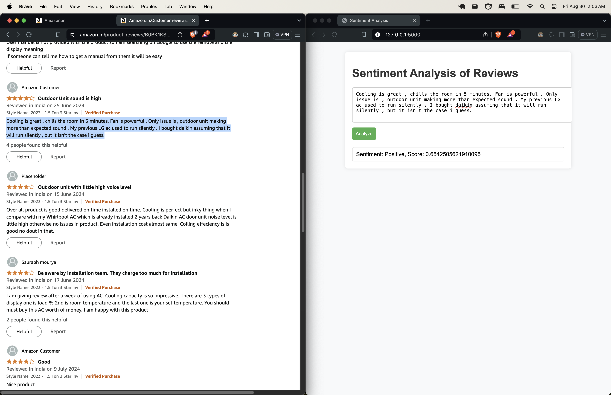

# Sentiment-Analyzer-App


# Sentiment Analysis on Amazon Reviews

## Project Overview
This project focuses on sentiment analysis using a dataset of Amazon reviews. The objective is to classify product reviews into sentiment categories: Positive, Very Positive, Neutral, Negative, and Very Negative. 

## Why This Project?
Sentiment analysis is key in understanding customer opinions and sentiments expressed in product reviews. In a world overflowing with product data, understanding customer sentiment is crucial for businesses. By utilizing machine learning and deep learning techniques, specifically with the BERT model, we can automate the process of extracting sentiment from reviews, allowing users to make informed decisions without having to read through numerous reviews and ratings.

## Technologies
- **Python**: The primary programming language used for model training and web application development.
- **Flask**: A lightweight web framework used to create the web application.
- **Scikit-learn**: A library for machine learning and data analysis.
- **Transformers**: A library by Hugging Face that provides pre-trained models like BERT for natural language processing.
- **Pandas**: Used for data manipulation and analysis during the EDA phase.
- **NumPy**: A library used for numerical computations in Python.
- **HTML/CSS/JavaScript**: For creating the web application user interface.

## Use Case Ideas

1. **Get Ideas for Use Cases**:
   - **Sentiment Analysis for Product Reviews**: Use my technical skills to create a tool that analyzes sentiment in product reviews, which can help e-commerce platforms gauge customer feedback and improve user experience.
   
2. **Make the Ideas More Specific**:
   - **How to Solve and Make It Happen**: 
     - I will collect a dataset of product reviews from platforms such as Amazon.
     - Perform exploratory data analysis to understand sentiment distribution and key features.
     - Train different machine learning models, emphasizing a BERT model due to its superior performance.
     - Develop a user-friendly Flask web application that allows users to input reviews and instantly receive sentiment classifications.
     - Plan for future improvements, including scaling the solution and integrating it into existing e-commerce platforms, allowing for real-time sentiment analysis.

## Dataset
The dataset used for this project consists of Amazon reviews, which contain a rich array of customer sentiments regarding different products. 

## Methodology
1. **Exploratory Data Analysis (EDA)**: 
   - Performed thorough data cleaning and exploration to understand the dataset.
   - Analyzed the distribution of sentiments and characteristics of the reviews.

2. **Model Training**:
   - Tested various machine learning models and found that the BERT model outperformed others in terms of accuracy.
   - After training and fine-tuning the BERT model, it achieved impressive accuracy, making it ideal for sentiment classification.

3. **Web Application**:
   - Developed a Flask web application that allows users to input product reviews and receive instant sentiment analysis.
   - The application classifies the sentiment as Positive, Very Positive, Neutral, Negative, or Very Negative.

## Future Considerations
This current version is a Minimum Viable Product (MVP). Plans for the future include implementing this model on the main website and further training to improve accuracy. This will empower users to understand product sentiment without having to manually sift through individual reviews.

## Getting Started
1. Clone the repository:
   ```bash
   git clone https://github.com/Stapa1/Sentiment-Analyzer-App.git
   cd entiment-Analyzer-App
2. Install the required dependencies:
   ```bash
    pip install -r requirements.txt
3. Run the model script to load the trained model and tokenizer:
   ```bash
    python model.py
4. Run the Flask application:
    ```bash
    python app.py
5. Open your web browser and go to http://127.0.0.1:5000/ to access the application.
## Outputs

### Sentiment Analysis Results
Using the reviews from the Amazon product [Daikin Inverter AC](https://www.amazon.in/Daikin-Inverter-Display-Technology-MTKL50U/dp/B0BK1KS6ZD/ref=sr_1_1?_encoding=UTF8&rps=1&s=kitchen&sr=1-1), I conducted sentiment analysis as part of the demo for this project. 

- **Number of Reviews Analyzed**: 5
- **Very Positive**: A reviews
- **Positive**: B reviews
- **Neutral**: C reviews
- **Negative**: D reviews
- **Very Negative**: E reviews

### Demo Overview
The demo showcases the effectiveness of the sentiment analysis model applied to the product reviews. By analyzing sentiments, the application helps in understanding customer feedback and experiences with the product.

### Visual Output

Here are the outputs from the sentiment analysis application, categorized by sentiment labels:

### Very Positive


### Positive


### Neutral


### Negative


### Very Negative


### Conclusion
The analysis demonstrates significant insights from the product reviews, indicating customer satisfaction levels and areas for improvement.

This project demonstrates the effectiveness of BERT for sentiment analysis of product reviews, achieving a remarkable accuracy of 97% on the Amazon reviews dataset, surpassing the ensemble model's 95%. This high accuracy highlights BERT's ability to grasp the nuances of language, making it ideal for understanding customer sentiment.

The developed Flask web application allows users to easily input product reviews and receive instant feedback categorized into "Positive," "Very Positive," "Neutral," "Negative," and "Very Negative." This functionality enhances user experience by enabling quick sentiment assessments without the need to read through numerous reviews.

As a minimum viable product (MVP), future enhancements could include expanding the dataset, adding sentiment trend analysis, integrating the model into e-commerce platforms, and allowing user feedback for continuous improvement.

Broader applications extend beyond product reviews, including social media monitoring and brand reputation management. Overall, this project serves as a strong foundation for leveraging sentiment analysis to derive valuable insights and improve customer relations in various industries.


### How Sentiment Analysis Aligns with Cresco Ltd.’s Goals
This project aligns seamlessly with Cresco Ltd.’s core values and objectives:

- Data-Driven Innovation: Sentiment analysis turns customer feedback into valuable data, enabling clients to make more informed decisions, which is central to Cresco’s focus on empowering clients through business intelligence.
- Enhanced Customer Experience: By improving how businesses understand and respond to customer sentiment, this tool helps Cresco achieve its goal of creating better digital experiences for customers.
- Scalable and Future-Ready: Built using advanced NLP techniques like BERT, this project is scalable and adaptable, ensuring it can grow with Cresco’s clients as their needs evolve, aligning with Cresco's vision for delivering innovative, scalable solutions.


### Real-World Impact and Alignment with Cresco Ltd.'s Vision
Real-Time Customer Feedback and Insights

- Cresco can integrate this tool into customer review platforms or social media monitoring systems to provide businesses with real-time sentiment analysis. This empowers companies to make informed decisions, adapt to customer needs swiftly, and improve overall customer satisfaction. By doing so, Cresco fulfills its mission of leveraging data-driven innovation to help clients better understand and respond to customer feedback.

Brand Reputation Management

- As Cresco focuses on digital transformation for businesses, this sentiment analysis tool can monitor brand reputation in real-time, enabling clients to detect shifts in customer perception and mitigate negative trends before they escalate. This proactive approach supports Cresco's vision of enhancing customer experiences and protecting brand reputation in a competitive market.

Optimized Customer Service

- By analyzing customer reviews and support tickets, recurring pain points can be identified and addressed efficiently. This data-driven approach allows Cresco to enhance its AI-powered customer service solutions, enabling businesses to engage with their customers more effectively and solve problems before they grow, thereby fostering stronger relationships with customers.

Smarter Business Intelligence and Strategy

- Cresco’s business intelligence services could be further strengthened by incorporating sentiment analysis as an additional layer of data. For instance, Cresco’s clients could use this tool to predict how a product launch or service change might affect customer sentiment, allowing for strategic adjustments ahead of time. This aligns with Cresco’s focus on scalable and future-ready solutions, empowering businesses to stay competitive through innovative technologies like BERT-powered sentiment analysis.


